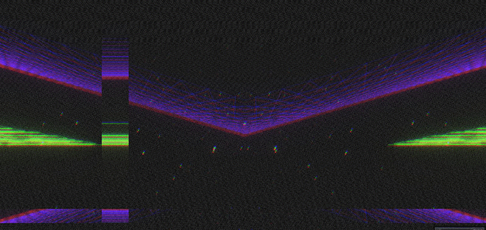

## Intro
This Audio Visual is in early alpha.
It takes the input from your microphone and splits the frequencies into two bands, lower and higher frequencies, and uses it to modulate the paramters 
of the 3D world and WebGL shaders.

## Technology used:
- Angular
- ThreeJs
- WebAudioApi 

## Usage
```bash
# run setup once, install libraries
npm install

# to launch it up
ng serve -o

```
I used angular to have a fast way for webpack, typescript and co setup.
Find the relevant code under `/src/app.component.ts`

Note that everything is highly experimental. :) 
If you have any questions don`t hesitate to contact me.

## Roadmap
- add Midi Input Support
- add Params to Morph the visual
- create interface with common visual setup to allow a collection with different
created visual and styles

## Preview 


